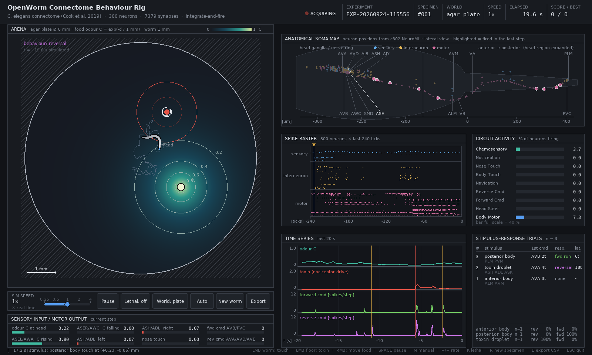

# OpenWorm Connectome Snake

A *C. elegans* that crawls, feeds and escapes under control of its real nervous
system, with a lab-style console for poking the worm and watching which
neurons respond.

The worm's brain is the full hermaphrodite connectome from
[OpenWorm / c302](https://github.com/openworm/c302) (Cook et al. 2019):
300 neurons, 148 muscles and other end organs, and 7,379 chemical and electrical synapses.
The console has two worlds:

- **Agar plate** (default): a soft 2D body driven by the 95 body-wall muscles
  crawls on a round plate. The body undulates from head to tail, and the worm
  reverses, turns, finds food by smell and backs away from toxins.
- **Grid snake**: the original snake game, with the same brain steering it.



## Quick start

```bash
git clone --recursive https://github.com/snuri00/openworm-connectome-snake.git
cd openworm-connectome-snake
pip install -r requirements.txt
python3 snake_worm.py                 # agar plate
python3 snake_worm.py --world grid    # grid snake
```

If you cloned without `--recursive`, fetch the connectome data with
`git submodule update --init`.

To benchmark the grid snake against a random-walking snake without opening a window:

```bash
python3 snake_worm.py --headless 50
```

## Interacting with the worm

| Action | What happens in the nervous system |
|---|---|
| Left-click the **head** | nose touch: FLP, OLQ, IL1, ASH |
| Left-click the **front half** of the body | gentle anterior touch: ALM, AVM |
| Left-click the **back half** of the body | gentle posterior touch: PLM, PVM |
| Left-click the **agar** | toxin droplet, sensed by the nociceptors ASH, ADL, ASK |
| Right-click | move the food source |

The panel under the arena has a speed slider (0.25–4× real time on the plate,
0.5–20 steps/s on the grid) and buttons for pause, lethal toxins/collisions,
world switching, manual steering (grid only), a new worm and CSV export.

Keyboard shortcuts:

| Key | Action |
|---|---|
| `W` | switch world |
| `SPACE` | pause |
| `+` / `-` | speed |
| `K` | lethal toxins / collisions |
| `M` | manual steering (grid only) |
| `R` | new worm |
| `E` | export CSV |
| `ESC` | quit |

### Console panels

- **Arena**: the food odour field with iso-concentration contours, toxins, the
  worm, the track of its head, and a 1 mm scale bar.
- **Anatomical soma map**: every neuron at its real position, taken from the c302
  NeuroML model. Neurons that fired in the last step are highlighted.
- **Spike raster**: all 300 neurons over the last 240 ticks, grouped into
  sensory, inter- and motor neurons. Stimulus onsets are marked.
- **Circuit activity**: percentage of neurons firing in 9 functional circuits.
- **Time series**: odour, toxin drive, and forward and reverse command activity.
- **Stimulus–response trials**: for every poke or toxin, the latency of the
  first command-neuron spike, the resulting behaviour and its latency.
- **Export (`E`)**: writes `recordings/<experiment>_timeseries.csv` and
  `recordings/<experiment>_trials.csv`.

## How it works

### Brain (`worm_brain.py`)

An integrate-and-fire network in the style of Busbice's GoPiGo connectome robot:

- Every cell accumulates synaptic input. When a neuron crosses its threshold it
  fires and resets. Muscles never fire; their input is read out every tick.
- Chemical synapses from GABAergic neurons (DD, VD, RME, RIS, AVL, DVB) are
  inhibitory.
- **Spike-frequency adaptation** stops the network from locking into
  seizure-like firing.
- Gap junctions are scaled down, except those of the touch receptor neurons,
  which reach the command interneurons mainly through gap junctions.
- Following Chalfie et al. (1985), the chemical synapses from ALM/AVM onto AVB
  and PVC are inhibitory.

### Body (`worm_body.py`)

A chain of 24 segments, one per body-wall muscle row, bending in the
dorsal/ventral plane (the worm crawls on its side). The body moves by
**resistive force theory**: drag on agar is about 30 times larger sideways than
lengthwise, and the body moves so that total force and torque are zero.
When a travelling wave is imposed on it, the body crawls at about 240 µm/s,
which is in the range of real worms on agar.

### Brain ↔ body loop (`worm_animal.py`)

- **Muscles to body**: body-wall muscle input from the connectome sets each
  segment's preferred curvature (dorsal minus ventral). Each muscle row's gain
  is normalised by its total motor innervation. A slow dorsal/ventral balance
  per row prevents the body from curling up, since there are 11 VB but only
  7 DB motor neurons.
- **Proprioception**: B-type motor neurons (VB/DB) feel the bending of the body
  just anterior to them and drive their own segment the same way, so a bend
  travels from head to tail (Wen et al. 2012). During reversals, A-type
  neurons (VA/DA) feel the body posterior to them and the wave runs tail to head.
- **Head rhythm**: an integrate-and-fire neuron has no intrinsic oscillation,
  so a pacemaker injects a 0.5 Hz alternating current into the head motor
  neurons RMDD and RMDV. It drives neurons, never muscles. The wave along the
  body comes entirely from the connectome and proprioception.

### Plate behaviour (`worm_plate.py`)

**Senses**

- **Smell**: the head compares the odour over the last 0.5 s with the 0.5 s
  before that. The chemosensory drive scales with the *relative* change
  (Weber-like), and it **adapts**: under a sustained change it fades with a
  1.5 s time constant, as AWC/ASE responses do.
- **Weathervaning**: the odour sampled on either side of the body axis during
  head sweeps biases the head motor neurons towards the richer side.
- **Plate rim**: nose touch, with the side taken from where the rim is.
- **Toxin**: concentration drives ASH/ADL/ASK, with the side taken from the bearing.

**Decisions**, made every 60 ms (6 brain ticks):

| Signal from the brain | Behaviour |
|---|---|
| reverse command AVA/AVD/AVE dominates | 1.5 s reversal, ending in a deep ventral omega turn (50 %) or a shallow turn |
| forward command AVB/PVC dominates | forward run (faster rhythm) |
| sustained left/right difference in head muscles (nose-touch reflex) | turn away |
| AIB activity, driven by AWC/ASER when the odour falls | reversal with probability proportional to AIB spikes: *pirouettes* (klinokinesis) |

A new worm crawls for 5 s off-screen before it is placed, so that its rhythm
and dorsal/ventral balance have settled.

### Grid snake (`snake_worm.py`)

Each game step runs 6 brain ticks. Head muscle activity decides turns; the
command interneurons decide reversals (the tail becomes the head) and forward runs.

## Measured behaviour

**Agar plate** (24–32 worms per condition, run in parallel)

| Test | Result |
|---|---|
| Crawling | ~190 µm/s net, sinusoidal head-to-tail wave (wavelength ≈ 0.86 body lengths) |
| Proprioception ablated (B-type gain 0) | no body wave, speed drops to 0 |
| Reverse crawling (A-type) | ~−260 µm/s |
| Nose / anterior / posterior touch | 66 % reversal / 95 % reversal / 87 % forward run |
| Toxin placed 0.9 mm ahead | closest approach 0.73 mm, or 0.50 mm with nociceptors ablated |
| Food found | 0.26 per minute, or 0 with odour sensing ablated |
| Weathervaning ablated | 0.32 per minute: no measurable benefit at this sample size |
| Pirouettes | ~4 per minute |
| Simulation speed | ~30× real time per core; the console uses ~30 % of one core |

**Grid snake**

| Test | Result |
|---|---|
| Mean score, connectome vs random | 2.7 vs 0.1 |
| Anterior body touch | 97 % reversal |
| Posterior body touch | 70 % forward run |

### Comparison with OpenWorm's Sibernetic demo

OpenWorm's 3D Sibernetic movie runs c302's forward-locomotion configuration
(`c302_FW.py`). That configuration has 39 neurons (AVB plus the B- and D-type
motor neurons), drives the head muscles directly with timed current pulses, and
changes many synapse weights. It has no senses. This project uses all 300 neurons
with the Cook et al. weights, keeps the rhythm generator out of the muscles, and
adds smell, touch and nociception. The trade-off is that the body is a 2D
resistive-force model rather than a 3D fluid simulation.

## Limitations

- The head rhythm is a pacemaker current, not an emergent property of the
  network. The same holds in c302's forward-locomotion model.
- Pirouettes are read from AIB activity because AIB → AVA does not reach the
  reversal threshold in this simple neuron model.
- **Curling**: the body is C-shaped about 24 % of the time. Most of this happens
  during reversals, omega turns and the seconds after them, when the worm is
  reorienting. It is a real behaviour, but it lasts longer than in real worms.
  Every attempt to suppress it also stopped the worm from finding food (about
  4× less), because reversals then stopped changing its heading. The attempts
  were: making RIA → SMD/RMD inhibitory, separate dorsal/ventral balance for
  the forward and reverse motor pools, and a phase-gated, compartmentalised RIA.
- RIA is a single integrate-and-fire unit. The real RIA has dorsal and ventral
  compartments that follow the head sweep, which is the likely basis of true
  weathervaning. The weathervane here is an explicit steering bias and shows
  no clear effect on food finding.
- Thresholds, adaptation, gap-junction scaling, proprioceptive gain and
  stimulus gains were tuned by hand.
- Turning uses the worm's left/right nose-touch reflex, mapped onto the
  dorsal/ventral bending plane. This mapping is a convention.
- The grid snake is not a skilled player. As its body grows it tends to trap itself.

## Files

| File | Purpose |
|---|---|
| `worm_brain.py` | connectome loader and integrate-and-fire network |
| `worm_body.py` | 2D soft body, resistive force theory |
| `worm_animal.py` | brain ↔ body loop: muscles, proprioception, head rhythm |
| `worm_plate.py` | agar-plate world: senses, behaviour, food, toxins |
| `snake_worm.py` | grid snake world, headless benchmark, entry point |
| `worm_hud.py` | experiment console (pygame) |
| `neuron_atlas.py` | soma positions and cell types from the c302 NeuroML file |
| `c302/` | OpenWorm c302 (git submodule, MIT licence): connectome and NeuroML data |

## Credits

- Connectome and NeuroML data: [OpenWorm c302](https://github.com/openworm/c302);
  Cook et al., *Nature* 571, 63–71 (2019).
- Proprioceptive coupling of B-type motor neurons: Wen et al., *Neuron* 76, 750–761 (2012).
- Touch circuit: Chalfie et al., *J. Neurosci.* 5, 956–964 (1985).
- AIB and reversals: Gray, Hill & Bargmann, *PNAS* 102, 3184–3191 (2005).
- Drag anisotropy on agar: Berri et al., *HFSP J.* 3, 186–193 (2009).
- GABAergic neurons: McIntire et al., *Nature* 364, 337–341 (1993).
- Integrate-and-fire approach: Timothy Busbice's connectome robot.
